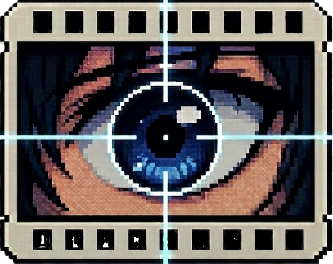

<div align="center">



# AnimeRS
### *Anime Reverse Searcher*

**Seen a cool anime scene but no idea where it's from? Drop it here.**

[](#-run-from-source-windows--macos--linux)
[](#)
[](#)
[](https://trace.moe)
[](LICENSE)


</div>


---

##  What it does

Take any screenshot, GIF, or video clip of an anime and drop it into AnimeRS to get back:

- 🎬 **Anime title** (English, romaji & native titles)
- 📅 **Season & episode**
- ⏱ **The exact timestamp** of the scene - for clips, the full time *range*
- 🖼 **Cover art, banner & episode info** pulled from AniList
- 📊 **A confidence score**, so you know how much to trust the match

## Why AnimeRS?

Most reverse-search tools look at a single image. AnimeRS samples multiple frames from GIFs and videos, searches each one, then combines the results into one final match. That makes it far more reliable when individual frames are blurry, dark, or difficult to identify.

## More it can do

- 📦 **Batch** - drop up to 20 files at once and click through the results
- 🕓 **History** - your last 50 searches, saved and reopenable
- ▶️ **Preview clip** - watch the matched scene right in the result
- 🎚 **Frame control** - let it choose, or set 1-16 frames per video
- 📋 **Paste, drag & drop, or browse** - on all three OSes

## Getting started

Grab your build from the [**v2.0 release**](https://github.com/111yoav111/AnimeRS/releases/tag/v2.0) — no installation, no Python.

| OS | Download |
|---|---|
| **Windows** (x64) | [`AnimeRS-windows-x64.exe`](https://github.com/111yoav111/AnimeRS/releases/download/v2.0/AnimeRS-windows-x64.exe) |
| **Linux** (x64) | [`AnimeRS-linux-x86_64.zip`](https://github.com/111yoav111/AnimeRS/releases/download/v2.0/AnimeRS-linux-x86_64.zip) |
| **macOS** (Apple Silicon) | [`AnimeRS-macos-arm64.zip`](https://github.com/111yoav111/AnimeRS/releases/download/v2.0/AnimeRS-macos-arm64.zip) |
| **macOS** (Intel) | [`AnimeRS-macos-x86_64.zip`](https://github.com/111yoav111/AnimeRS/releases/download/v2.0/AnimeRS-macos-x86_64.zip) |


Windows: double-click it. macOS & Linux: unzip and run. *(first launch takes a few seconds - it's unpacking itself)*

> **macOS:** the builds aren't code-signed, so the first launch needs a right-click → **Open**.

### Run from source

```bash
git clone https://github.com/111yoav111/AnimeRS.git
cd AnimeRS/app
pip install -r requirements.txt
python main.py
```

That's it — the app launches its own local backend automatically.

## Credits

- [**trace.moe**](https://trace.moe) by [**soruly**](https://github.com/soruly) — the incredible anime scene search engine doing the heavy lifting
- [**AniList**](https://anilist.co) — artwork, descriptions and episode metadata
- Built with [PyQt6](https://www.riverbankcomputing.com/software/pyqt/), [FastAPI](https://fastapi.tiangolo.com/) and [imageio](https://imageio.readthedocs.io/)

<div align="center">

**Developed by [111yoav111](https://github.com/111yoav111)** · found it useful? a ⭐ makes my day

</div>
